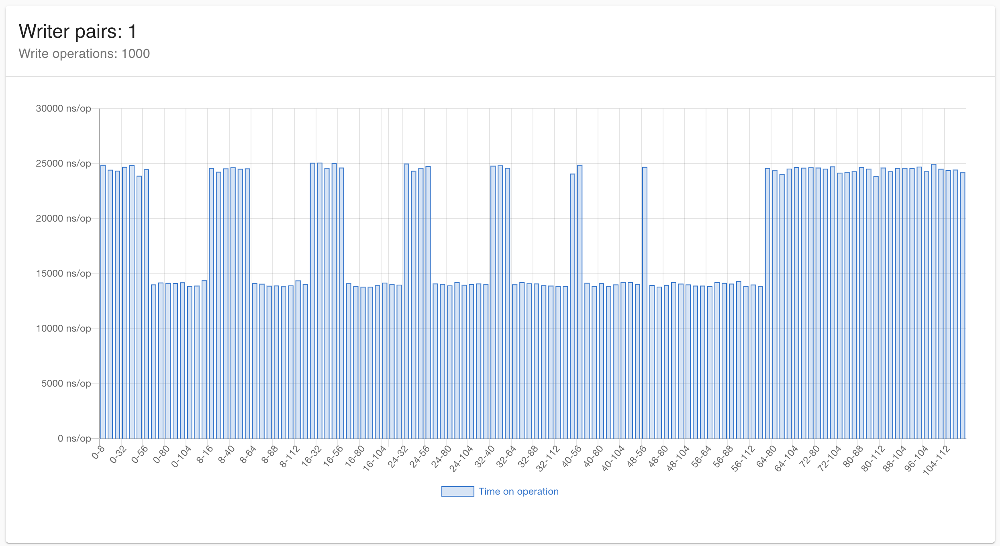

## False sharing benchmarks
This repo contains benchmarks demonstrated false sharing impact.

Here is an example of [false sharing](https://en.wikipedia.org/wiki/False_sharing). Charts based on `results.json` you can find [here](https://storage.googleapis.com/false-sharing-charts/index.html). 
Main idea was to demonstrate differences in performance when we have false sharing and when writing into different [cache lines](https://en.wikipedia.org/wiki/CPU_cache). 

Provided benchmarks contain next sets: 1, 2, 10, 100 writer pairs. Which means we have 2, 4, …, 200 goroutines to show how performance changes when the number of concurrent operations grows. For each write pair we have we run a set of 10, 100, 1000, 10000 volatile operations that guarantee “happens before” relation. 
For each combination of provided above sets, application runs golang benchmark.

Y-axis - time spent on operation (lower better). X-axis - shows offsets for field pairs where the operation was carried out. For example 0-8 means goroutine 1 writes to field by offset 0 and goroutine 2 writes to field by offset 8. 

As we can easily find for cases when the number of operations less or equal 100, false sharing cases are almost indistinguishable with write to separate cache lines. However, in cases where the number of operations increases, there are clear boundaries of the false sharing effect.

Image below demonstrates one of benchmark results

